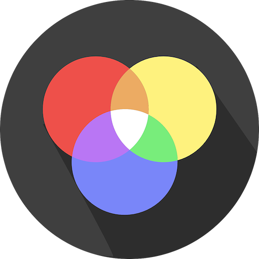
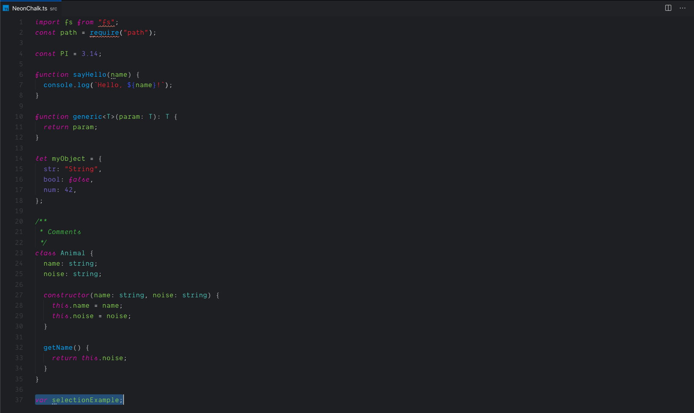

  
  <h1 style="margin-left: 16px;">Neon Chalk</h1>

 

  &nbsp;
  &nbsp;
  &nbsp;
  

---

## Installation

Install it for free from [Microsoft Marketplace](https://marketplace.visualstudio.com/items?itemName=brandon-burrus.neon-chalk)!

Theme was designed to be used specifically with the [Material File Icon Theme](https://marketplace.visualstudio.com/items?itemName=brandon-burrus.neon-chalk) and the [Dank Mono](https://dank.sh/) font!

## Issues

If you find any issues, please fill out a [bug report](https://github.com/BrandonBurrus/vscode-neon-chalk-theme/issues/new/choose), and [PR](https://github.com/BrandonBurrus/vscode-neon-chalk-theme/pulls)s are always welcome 😃

## Support

<link href="https://fonts.googleapis.com/css?family=Rubik" rel="stylesheet"><a class="bmc-button" target="_blank" href="https://www.buymeacoffee.com/brandonburrus">Buy me a coffee!</a>
